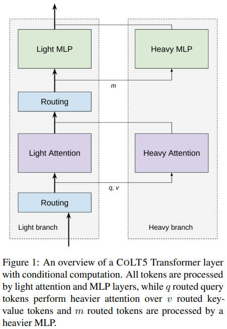

</img>

## CoLT5 Attention - Pytorch

Implementation of the conditionally routed efficient attention in the proposed <a href="https://arxiv.org/abs/2303.09752">CoLT5</a> architecture, in Pytorch.

They used coordinate descent from <a href="https://arxiv.org/abs/2211.01267">this paper</a> (main algorithm originally from <a href="https://arxiv.org/abs/1502.04759">Wright et al</a>) to route a subset of tokens for 'heavier' branches of the feedforward and attention blocks.

Update: unsure of how the routing normalized scores for the key-values are used. Did some improvising there, <a href="https://github.com/lucidrains/CoLT5-attention/blob/main/colt5_attention/transformer_block.py#L86">scaling the projected values</a>, but if you think you know the answer, please open an issue

Update 2: seems to work well with the improvisation above

## Appreciation

- <a href="https://stability.ai/">Stability.ai</a> for the generous sponsorship to work on cutting edge artificial intelligence research

- <a href="https://github.com/arogozhnikov/einops">einops</a> for making my life easy

- <a href="https://github.com/openai/triton">Triton</a> for allowing me to speed up coordinate descent with a fused implementation in just 2 days, sparing me from having to write a thousand lines of CUDA code

## Install

```bash
$ pip install colt5-attention
```

## Usage

```python
import torch

from colt5_attention import (
    ConditionalRoutedFeedForward,
    ConditionalRoutedAttention,
    ConditionalRoutedTransformerBlock
)

# mock input, say it is 32768 length

tokens = torch.randn(2, 32768, 512)
mask = torch.ones(2, 32768).bool()  # can handle variable lengthed sequences

# feedforward

ff = ConditionalRoutedFeedForward(
    dim = 512,
    light_ff_mult = 0.5,      # hidden dimension ratio of light branch
    heavy_ff_mult = 4,        # hidden dimension ratio of heavy branch
    num_heavy_tokens = 1024   # heavy branch receives only 1024 routed tokens of 32768
)

ff_out = ff(tokens, mask = mask)  # (2, 32768, 512) - light and heavy branch summed

# attention

attn = ConditionalRoutedAttention(
    dim = 512,
    light_dim_head = 64,       # attention head dimension of light branch
    light_heads = 8,           # number of attention heads for light branch
    light_window_size = 128,   # local attention receptive field for light
    heavy_dim_head = 64,       # attention head dimension of heavy branch
    heavy_heads = 8,           # number of attention heads for heavy branch
    num_heavy_tokens_q = 1024, # heavy branch receives only 1024 routed tokens of 32768
    num_heavy_tokens_kv = 1024 # heavy branch receives only 1024 routed tokens of 32768
)

attn_out = attn(tokens, mask = mask) # (2, 32768, 512) - light and heavy branch summed

# both attention and feedforward with residual
# the complete transformer block
# a stack of these would constitute the encoder of CoLT5

block = ConditionalRoutedTransformerBlock(
    dim = 512,
    light_dim_head = 64,
    light_heads = 8,
    light_window_size = 128,
    heavy_dim_head = 64,
    heavy_heads = 8,
    light_ff_mult = 0.5,
    heavy_ff_mult = 4,
    num_heavy_ff_tokens = 1024,
    num_heavy_attn_tokens_q = 1024,
    num_heavy_attn_tokens_kv = 1024
)

block_out = block(tokens, mask = mask) # (2, 32768, 512)
```

Also included a variation of the conditionally routed attention for cross attention, to be tried with long context memories in a transformer-xl

```python
import torch
from colt5_attention import ConditionalRoutedCrossAttention

# mock input, let us say it is a transformer of 1024 length attending to 1 million context past memories

tokens = torch.randn(1, 1024, 512).cuda()
tokens_mask = torch.ones(1, 1024).bool().cuda()

memories = torch.randn(1, 1_048_576, 512).cuda()
memories_mask = torch.ones(1, 1_048_576).bool().cuda()

# conditionally routed cross attention

cross_attn = ConditionalRoutedCrossAttention(
    dim = 512,
    dim_head = 64,
    heads = 8,
    num_tokens_q = 512,         # only 512 routed from 1024
    num_tokens_kv = 1024,       # only 1024 routed from 1 million
    kv_routing_tokens = 2,      # say you want 2 routing tokens to route different sets of key / values to the queries. 4 attention heads will be allocated to each routed set in this example (8 / 2)
    use_triton = True,          # use cuda kernel
    route_block_size = 131072   # route in blocks of 131072
).cuda()

cross_attn_out = cross_attn(
    tokens,
    context = memories,
    mask = tokens_mask,
    context_mask = memories_mask
)

cross_attn_out.shape # (1, 1024, 512) - same as tokens
```

This repository also has an improvised version for autoregressive attention. The way this was achieved was by viewing the sequence in windows. Each window can only attend to windows of key / values into the past. The local attention of the light branch covers the intra-window attention.

The coordinate descent is made viable through a CUDA kernel written in <a href="https://github.com/openai/triton">Triton</a>. Finally, to get autoregressive generation to work well, I had to make sure for the unrouted tokens (for queries), outputs a learned output embedding rather than just zeros.

Currently I am seeing occasional differences between the gradients (as high as 1e-1 for a very small fraction of elements) once the number of iterations exceed 20. However, enwik8 seems to train well and I can see the effects of the routing. Training is surprisingly stable too

ex.

```python
import torch
from colt5_attention import ConditionalRoutedAutoregressiveAttention

# mock input, say it is 8192 length

tokens = torch.randn(2, 8192, 512).cuda()

# attention

attn = ConditionalRoutedAutoregressiveAttention(
    dim = 512,
    light_dim_head = 64,          # attention head dimension of light branch
    light_heads = 8,              # number of attention heads for light branch
    light_window_size = 128,      # local attention receptive field for light
    heavy_window_size = 128,      # the windowing for the routed heavy attention, by default, will be equal to the light window size. be aware if this is any greater than the light window size, there may be tokens that would be missed by attention
    heavy_dim_head = 64,          # attention head dimension of heavy branch
    heavy_heads = 8,              # number of attention heads for heavy branch
    num_heavy_tokens_q = 32,      # heavy branch receives only 32 out of 128 of the windowed queries (1024 query tokens total)
    num_heavy_tokens_kv = 1024,   # heavy branch receives only 1024 routed tokens for key-values
    num_routed_kv = 2,            # one can split the attention heads so that groups of heads attend to different sets of key - values (2 routing tokens in this case)
    use_triton = True,            # will need to use Triton for this to be viable, otherwise it is too slow and memory efficient with the number of iterations
    use_flash_attn = True         # use flash attention in heavy branch
).cuda()

attn_out = attn(tokens) + tokens # (2, 8192, 512) - output of attention with residual (prenorm is included)
```

Finally, this repository contains a version for image feature maps. Typically a lot of research papers cannot do attention on image feature maps with dimensions greater than 32 by 32. This routed attention will use a local window patch for the light branch, and routed attention for the heavy

ex.

```python
import torch
from colt5_attention import ConditionalRoutedImageAttention

attn = ConditionalRoutedImageAttention(
    dim = 32,
    light_dim_head = 64,       # attention head dimension of light branch
    light_heads = 8,           # number of attention heads for light branch
    light_window_size = 32,    # height and width of local window attention on the image feature map
    channel_first = True,      # whether to accept images with channel first than last
    heavy_dim_head = 64,       # attention head dimension of heavy branch
    heavy_heads = 8,           # number of attention heads for heavy branch
    num_heavy_tokens_q = 1024, # heavy branch receives only 1024 routed tokens of 65536
    num_heavy_tokens_kv = 1024 # heavy branch receives only 1024 routed tokens of 65536
).cuda()

fmap = torch.randn(1, 32, 256, 256).cuda() # image feature map is too large for attention, given 256 ^ 2  == 65536 tokens

out = attn(fmap)
```

<a href="https://arxiv.org/abs/2205.01580">Simple ViT</a> using coordinate descent routed attention and feedforward

```python
import torch
from colt5_attention.vit import ConditionalRoutedViT

vit = ConditionalRoutedViT(
    image_size = 256,                # image size
    patch_size = 32,                 # patch size
    num_classes = 1000,              # number of output classes
    dim = 1024,                      # feature dimension
    depth = 6,                       # depth
    attn_num_heavy_tokens_q = 16,    # number of routed queries for heavy attention
    attn_num_heavy_tokens_kv = 16,   # number of routed key/values for heavy attention
    attn_heavy_dim_head = 64,        # dimension per attention head for heavy
    attn_heavy_heads = 8,            # number of attention heads for heavy
    attn_light_window_size = 4,      # the local windowed attention for light branch
    attn_light_dim_head = 32,        # dimension per head for local light attention
    attn_light_heads = 4,            # number of attention heads for local windowed attention
    ff_num_heavy_tokens = 16,        # number of tokens routed for heavy feedforward
    ff_heavy_mult = 4,               # the expansion factor of the heavy feedforward branch
    ff_light_mult = 2                # expansion factor of the light feedforward branch
)

images = torch.randn(1, 3, 256, 256)

logits = vit(images) # (1, 1000)
```

## Todo

- [x] add the coordinate descent method as another router
- [x] allow for multi-headed routing (multiple routing tokens), only for key-values
- [x] add an autoregressive version of the conditionally routed attention
- [x] test out the autoregressive version and verify that more routed key / value tokens lead to better results - it works
- [x] make flash attention compatible
- [x] create a variant of CoLT5 for high resolution feature maps (image attention) - then try out for diffusion
- [x] fused coordinate descent kernel using triton
    - [x] forwards        
    - [x] backwards
    - [x] benchmark triton vs plain pytorch coor_descent - 50 iterations with 4 segments - 18.5x faster for forward (7.23 vs 0.39), 7.2x faster for backwards (5.77 vs 0.80)
    - [x] fall back on plain coordinate descent for cpu
    - [x] handle edge case for when a row is completely masked out for triton, or simply enforce it never to be so
    - [x] fix masking in coordinate descent
    - [x] simplified some logic within the triton kernel and the problem went away. probably some tiny quirk with the compiler
    - [x] maximum block size in triton allowed is 131k, make sure at least quarter of million sequence length can be reached. to get around this initially, one can fold a million token sequence into ~9 131k and uniformly route. offer uniform routing scheme within router itself
    - [x] remove sinkhorn and cumulative softmax approaches and cleanup; neither can work as well as coordinate descent
    - [x] allow for saving intermediates every number of iterations - trading memory for recompute efficiency during backwards
    - [x] in-place write to checkpointed a and b tensor for potentially savings on forward when recompute segments is high

## Citations

```bibtex
@inproceedings{Ainslie2023CoLT5FL,
    title   = {CoLT5: Faster Long-Range Transformers with Conditional Computation},
    author  = {Joshua Ainslie and Tao Lei and Michiel de Jong and Santiago Ontan'on and Siddhartha Brahma and Yury Zemlyanskiy and David Uthus and Mandy Guo and James Lee-Thorp and Yi Tay and Yun-Hsuan Sung and Sumit Sanghai},
    year    = {2023}
}
```

```bibtex
@article{Tillet2019TritonAI,
    title   = {Triton: an intermediate language and compiler for tiled neural network computations},
    author  = {Philippe Tillet and H. Kung and D. Cox},
    journal = {Proceedings of the 3rd ACM SIGPLAN International Workshop on Machine Learning and Programming Languages},
    year    = {2019}
}
```

```bibtex
@inproceedings{dao2022flashattention,
    title     = {Flash{A}ttention: Fast and Memory-Efficient Exact Attention with {IO}-Awareness},
    author    = {Dao, Tri and Fu, Daniel Y. and Ermon, Stefano and Rudra, Atri and R{\'e}, Christopher},
    booktitle = {Advances in Neural Information Processing Systems},
    year      = {2022}
}
```

```bibtex
@article{Lei2023ConditionalAP,
    title   = {Conditional Adapters: Parameter-efficient Transfer Learning with Fast Inference},
    author  = {Tao Lei and Junwen Bai and Siddhartha Brahma and Joshua Ainslie and Kenton Lee and Yanqi Zhou and Nan Du and Vincent Zhao and Yuexin Wu and Bo Li and Yu Zhang and Ming-Wei Chang},
    journal = {ArXiv},
    year    = {2023},
    volume  = {abs/2304.04947}
}
```

```bibtex
@article{Beyer2022BetterPV,
    title   = {Better plain ViT baselines for ImageNet-1k},
    author  = {Lucas Beyer and Xiaohua Zhai and Alexander Kolesnikov},
    journal = {ArXiv},
    year    = {2022},
    volume  = {abs/2205.01580}
}
```
